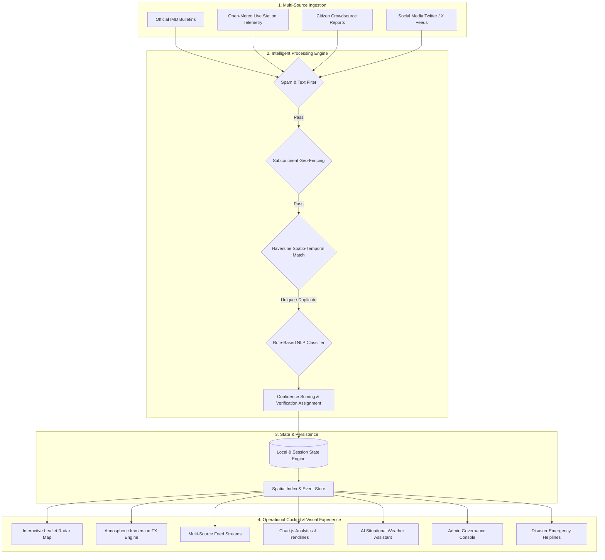

# 🌦️ CLOUD NET

### Intelligent IMD Weather Event Aggregation, Verification & Anomaly Detection Platform

[](https://react.dev/)
[](https://www.typescriptlang.org/)
[](https://vitejs.dev/)
[](https://tailwindcss.com/)
[](https://leafletjs.com/)
[](https://www.chartjs.org/)
[](LICENSE)

**CLOUD NET** is an enterprise-grade, next-generation meteorological incident intelligence and situational awareness platform. Built specifically for India's weather landscape and the **India Meteorological Department (IMD)** ecosystem, it aggregates multi-source weather reports, executes automated spatial-temporal deduplication, performs spam and boundary validation, streams real-time sensor telemetry, and empowers emergency response authorities with actionable analytics.

---

## 📑 Table of Contents

- [Key Capabilities & Highlights](#-key-capabilities--highlights)
- [System Architecture](#-system-architecture)
- [Core Features Walkthrough](#-core-features-walkthrough)
  - [1. Multi-Source Stream Ingestion](#1-multi-source-stream-ingestion)
  - [2. Automated Verification & Deduplication Pipeline](#2-automated-verification--deduplication-pipeline)
  - [3. Interactive Geospatial Radar Map](#3-interactive-geospatial-radar-map)
  - [4. Dynamic Atmospheric Immersion Engine](#4-dynamic-atmospheric-immersion-engine)
  - [5. AI Situational Weather Assistant](#5-ai-situational-weather-assistant)
  - [6. Real-Time Telemetry & City Glance Ribbon](#6-real-time-telemetry--city-glance-ribbon)
  - [7. Comprehensive Analytics & Metrics](#7-comprehensive-analytics--metrics)
  - [8. Incident Simulation Suite](#8-incident-simulation-suite)
  - [9. Admin & Governance Panel](#9-admin--governance-panel)
  - [10. Emergency Helplines & Disaster Response](#10-emergency-helplines--disaster-response)
- [Technology Stack](#-technology-stack)
- [Directory Structure](#-directory-structure)
- [Getting Started](#-getting-started)
  - [Prerequisites](#prerequisites)
  - [Installation](#installation)
  - [Local Development](#local-development)
  - [Production Build](#production-build)
- [Configuration & Integration](#-configuration--integration)
- [Git & Deployment Guide](#-git--deployment-guide)
- [Contributing](#-contributing)
- [License](#-license)

---

## ⚡ Key Capabilities & Highlights

* **Sub-Second Incident Ingestion**: Unifies official IMD observations, real-time sensor APIs, crowdsourced citizen submissions, and Twitter/X social feeds into a singular operational dashboard.
* **Haversine Spatio-Temporal Deduplication**: Filters redundant and overlapping field reports within an 18 km proximity and 4-hour temporal window, clustering them under primary incident records.
* **Autonomous Geo-Fencing & Spam Filtering**: Automatically screens incoming incidents against the Indian meteorological bounding coordinates (Lat 6°–38°N, Lng 68°–98°E) and bans malicious or promotional payloads.
* **Live Sensor Telemetry Integration**: Queries Open-Meteo REST APIs across 20+ major Indian meteorological stations with automated 45-second background polling.
* **Full-Spectrum Atmospheric Immersion**: Real-time canvas and CSS particle engine rendering rain, lightning bolts, dense fog, heatwave mirage, dust storm haze, and wind vectors based on active weather conditions.
* **Conversational AI Weather Assistant**: Context-aware assistant providing natural language briefings, emergency safety instructions, and direct interactive map pin-pointing.
* **Role-Based Incident Governance**: Administrative console supporting incident status override (`verified`, `flagged`, `duplicate`), threshold calibration, and full CSV/JSON audit export.

---

## 🏗️ System Architecture



---

## 🌟 Core Features Walkthrough

### 1. Multi-Source Stream Ingestion
- **Official IMD Feeds**: Certified weather bulletins and alerts from India Meteorological Department regional centers.
- **Sensor Telemetry**: Real-world atmospheric readings including ambient temperature (°C), rain rate (mm), relative humidity (%), surface pressure (hPa), and wind velocity (km/h).
- **Citizen Field Reports**: Community-driven reporting modal capturing live device GPS coordinates, event categorization, photo/video attachments, and witness testimonies.
- **Social Media Scraper Simulation**: Ingests high-velocity Twitter/X reports containing `#IMD`, `#WeatherAlert`, and regional storm hashtags.

### 2. Automated Verification & Deduplication Pipeline
- **Haversine Distance Matching**:
  $$\text{Distance} = 2 R \cdot \arcsin\left(\sqrt{\sin^2\left(\frac{\Delta\phi}{2}\right) + \cos\phi_1 \cos\phi_2 \sin^2\left(\frac{\Delta\lambda}{2}\right)}\right)$$
  Identifies and merges incoming reports within $\le 18\text{ km}$ and $\le 4\text{ hours}$ of existing verified events, preventing dashboard alert fatigue.
- **Indian Territory Geofencing**: Enforces latitude ($5^\circ\text{N} - 38^\circ\text{N}$) and longitude ($67^\circ\text{E} - 99^\circ\text{E}$) boundaries, flagging coordinates outside the Indian subcontinent.
- **Spam & Malicious Payload Detection**: Evaluates incoming reports against heuristic threat patterns (promotions, cryptocurrency spam, fraudulent links).
- **Automated NLP Classification**: Analyzes colloquial and regional terminology (e.g., *barish*, *bijli*, *kalbaishakhi*, *kohra*, *loo*, *andhi*) to categorize events into 7 standard categories with confidence scores (0–100%).

### 3. Interactive Geospatial Radar Map
- **Interactive Leaflet Integration**: Custom-styled dark navy map canvas loaded with geographical markers across India.
- **Doppler Sweep Radar Simulation**: Conic sweep radar beam overlay mimicking meteorological radar operations.
- **Severity & Category-Coded Markers**: Visual differentiation across Rainfall, Thunderstorm, Flooding, Heatwave, Fog, Dust Storm, and Strong Wind.
- **Deep-Dive Event Cards**: Click any map marker to open detailed telemetry cards, verification badges, and spatial coordinates.

### 4. Dynamic Atmospheric Immersion Engine
- **Full-Screen Canvas Weather Visualizers**: Dynamically adapts interface background atmosphere to match selected weather events:
  - **Rainfall**: High-density diagonal rain streaks with surface splash ripples.
  - **Thunderstorm**: Intermittent stochastic lightning flashes with stormy cloud ambiance.
  - **Flooding**: Swirling water-reflection shimmer and rising moisture particles.
  - **Heatwave**: Rising radiant heat mirage waves and solar glare flare.
  - **Fog**: Drifting volumetric mist layers obscuring and revealing background layers.
  - **Dust Storm**: Terracotta dust clouds and sand particles swirling at high velocity.
  - **Strong Wind**: Horizontal aerodynamic slipstream wind streaks.
- **Weather Mood Bar**: One-click manual override to preview individual weather mood styles and presets.

### 5. AI Situational Weather Assistant
- **Real-Time Natural Language Inquiries**: Ask questions like *"What is the weather status in Mumbai?"*, *"Are there any active flood alerts in Assam?"*, or *"Show me safety measures for heatwaves"*.
- **Direct Map Interactivity**: The AI assistant provides executable action chips (e.g., `Focus New Delhi on Map`) that immediately center the geospatial view on the queried region.
- **Emergency Safety Protocols**: Provides contextual do's and don'ts during severe meteorological anomalies.

### 6. Real-Time Telemetry & City Glance Ribbon
- Quick-glance ribbon displaying real-time atmospheric metrics for top Indian metros: **New Delhi, Mumbai, Kolkata, Chennai, Bengaluru, Hyderabad, Ahmedabad, Pune, Guwahati, Jaipur**, and more.
- Real-time station telemetry auto-refreshed every 45 seconds via Open-Meteo.

### 7. Comprehensive Analytics & Metrics
- **Severity Breakdown**: Visual distribution of Low, Moderate, Severe, and Extreme events.
- **Category Matrix**: Volume breakdown across all 7 meteorological disaster types.
- **24-Hour Timeline Activity**: Temporal wave chart tracking incident velocity throughout the day.
- **Verification Funnel**: Distribution of Verified, Unverified, Flagged, and Merged Duplicate incidents.

### 8. Incident Simulation Suite
- Test system resilience by dispatching simulated weather anomalies:
  - **Mumbai Monsoon Flash Flood** (Extreme severity, rain rate > 85mm/h)
  - **Delhi Palam Dense Fog Alert** (Zero visibility, flight delays)
  - **Rajasthan Thar Desert Heatwave** (Temperature > 47°C)
  - **Bay of Bengal Cyclonic Squall** (Wind speeds > 95 km/h)
  - **Spam & Coordinate Attack** (Validates filtering pipeline in real-time)

### 9. Admin & Governance Panel
- Protected credential gate (`admin` / default credentials).
- **Incident Moderation**: Override AI verification statuses, mark false alarms, or unlink false duplicates.
- **Threshold Tuning**: Adjust deduplication radius (km), time window (hours), and AI confidence cutoffs.
- **Data Export**: Export complete event telemetry logs to CSV or formatted JSON for external reporting.

### 10. Emergency Helplines & Disaster Response
- Instant one-click contact directory for vital Indian disaster agencies:
  - **IMD Weather Helpline**: `1800-180-1717`
  - **National Disaster Response Force (NDRF)**: `011-24363260` / `9711077372`
  - **National Emergency Number**: `112`
  - **Disaster Management Services**: `1070` / `1077`
  - **Ambulance**: `108` / `102` | **Police**: `100`

---

## 🛠️ Technology Stack

| Layer | Technology | Description |
| :--- | :--- | :--- |
| **Core Framework** | [React 18.3](https://react.dev/) | Modern declarative UI component library with Hooks |
| **Language** | [TypeScript 5.7](https://www.typescriptlang.org/) | Strict type safety, type definitions, and interfaces |
| **Bundler & Dev Server** | [Vite 5.4](https://vitejs.dev/) | Ultra-fast Hot Module Replacement (HMR) and optimized build |
| **Styling & Design System** | [Tailwind CSS 3.4](https://tailwindcss.com/) | Custom navy/slate palette, glassmorphism, responsive utilities |
| **Geospatial Mapping** | [Leaflet 1.9](https://leafletjs.com/) | Interactive web maps, custom SVG markers, radar overlays |
| **Data Visualizations** | [Chart.js 4.4](https://www.chartjs.org/) + [react-chartjs-2](https://react-chartjs-2.js.org/) | Canvas charts: Bar, Doughnut, Line, and Area graphs |
| **Iconography** | [Lucide React](https://lucide.dev/) | Clean, accessible, modern SVG icon system |
| **FX & Micro-Interactions** | [canvas-confetti](https://www.npmjs.com/package/canvas-confetti) | Confetti & celebratory micro-interactions for citizen submissions |
| **Live Sensor Telemetry** | [Open-Meteo REST API](https://open-meteo.com/) | Open-source non-commercial meteorological telemetry API |
| **Hosting & Deployment** | [Vercel](https://vercel.com/) | Single-page application SPA routing and edge distribution |

---

## 📁 Directory Structure

```text
cloudnet-main/
├── index.html                  # HTML entry point with Google Fonts & Leaflet styles
├── package.json                # Project dependencies and script declarations
├── postcss.config.js           # PostCSS Tailwind plugins configuration
├── tailwind.config.js          # Custom colors (navy-950, cyan, neon green) & keyframes
├── tsconfig.json               # TypeScript compiler options
├── vercel.json                 # Vercel deployment rewrite rules for SPA
├── vite.config.ts              # Vite bundler configuration with React plugin
├── src/
│   ├── App.tsx                 # Root application state, layout & real-time polling
│   ├── main.tsx                # React DOM render root
│   ├── index.css               # Global CSS, scrollbar styling & animation keyframes
│   ├── components/             # Reusable UI & operational modules
│   │   ├── AdminLoginModal.tsx         # Admin PIN / credentials modal
│   │   ├── AdminPanel.tsx              # Incident moderation, rule tuning & CSV export
│   │   ├── AnalyticsCharts.tsx         # Chart.js metrics, severity & timeline charts
│   │   ├── CitizenReportModal.tsx      # Public incident reporting submission form
│   │   ├── CityGlanceBar.tsx           # Real-time top Indian metros telemetry ribbon
│   │   ├── EmergencyHelplineModal.tsx  # NDRF, SDRF, IMD helplines quick-dial modal
│   │   ├── EventDetailModal.tsx        # Deep-dive incident inspector with full metadata
│   │   ├── FilterBar.tsx               # Multi-category, source, status & state filter bar
│   │   ├── LiveFeedList.tsx            # Incident card feed with status badges & tags
│   │   ├── LiveTicker.tsx              # Top scrolling breaking alerts ticker ribbon
│   │   ├── MapView.tsx                 # Leaflet interactive map with Doppler radar sweep
│   │   ├── MultiSourceFeedsView.tsx    # Split-column view (IMD, Citizen, Social Media)
│   │   ├── Navbar.tsx                  # Top navigation, status indicator, action buttons
│   │   ├── SimulationControls.tsx      # Extreme weather & spam scenario injector
│   │   ├── StatsOverview.tsx           # High-level operational KPI metric counters
│   │   ├── WeatherAIChatbot.tsx        # Natural language AI weather assistant drawer
│   │   ├── WeatherAtmosphere.tsx       # Canvas particle weather visualizer (rain, fog, etc.)
│   │   ├── WeatherMoodBar.tsx          # Atmosphere manual selector & preview bar
│   │   └── icons/                      # Custom meteorological SVG iconography
│   ├── data/
│   │   └── initialEvents.ts    # Seed meteorological events, Indian city coordinates & themes
│   ├── services/
│   │   ├── aiWeatherAssistant.ts       # NLP query matching, briefings & map actions
│   │   ├── processingEngine.ts         # Haversine distance, deduplication & geo-fencing
│   │   ├── spatialIndex.ts             # Spatial indexing & coordinate utility functions
│   │   ├── storage.ts                  # LocalStorage persistence & custom event dispatcher
│   │   ├── streamQueue.ts              # Ingestion queue handling & event buffering
│   │   └── weatherApi.ts               # Open-Meteo REST API client & WMO code mapper
│   └── types/
│       └── weather.ts          # Comprehensive TypeScript interfaces & type unions
```

---

## 🚀 Getting Started

### Prerequisites

Make sure you have the following installed on your workstation:
- **Node.js**: `v18.0.0` or later (tested with Node `v20` / `v24`)
- **npm**: `v9.0.0` or later (or `yarn` / `pnpm`)
- **Git**: Installed and configured on your system

### Installation

1. **Clone the Repository** (or navigate to your local directory):
   ```bash
   git clone https://github.com/khushi2006y/cloud-net.git
   cd cloud-net
   ```

2. **Install Dependencies**:
   ```bash
   npm install
   ```

### Local Development

Start the local Vite development server with hot module replacement:

```bash
npm run dev
```

Open your browser and navigate to:
```
http://localhost:5173
```

### Production Build

To compile TypeScript and build the optimized production assets:

```bash
npm run build
```

The production-ready bundle will be output to the `dist/` directory.

To preview the production build locally:
```bash
npm run preview
```

---

## ⚙️ Configuration & Integration

### Open-Meteo Live API
The application connects out-of-the-box to Open-Meteo's open meteorological API (`https://api.open-meteo.com/v1/forecast`) for coordinates across 20+ major Indian meteorological centers. No API key is required for development.

### Customizing Indian Stations
Additional observation centers can be configured inside [`src/data/initialEvents.ts`](src/data/initialEvents.ts) under `MAJOR_INDIAN_CITIES`:

```typescript
export const MAJOR_INDIAN_CITIES = [
  { name: 'New Delhi', state: 'Delhi', lat: 28.6139, lng: 77.2090 },
  { name: 'Mumbai', state: 'Maharashtra', lat: 19.0760, lng: 72.8777 },
  // Add new observation nodes here
];
```

---

## 📤 Git & Deployment Guide

### 1. Initialize & Commit Locally

If you haven't initialized Git in your local folder yet:

```bash
# Initialize git repository
git init

# Set default branch to main
git branch -M main

# Configure your Git user identity (if not globally set)
git config user.name "Your Name"
git config user.email "your.email@example.com"

# Stage all files
git add .

# Create initial commit
git commit -m "feat: initial release of CloudNet IMD weather platform"
```

### 2. Push to GitHub

1. Create a new repository on [GitHub](https://github.com/new) named `cloudnet`.
2. Connect your local repository and push:

```bash
# Add remote origin
git remote add origin https://github.com/khushi2006y/cloud-net.git

# Push to GitHub
git push -u origin main
```

### 3. Deploy to Vercel (1-Click)

The repository includes a ready-to-deploy [`vercel.json`](vercel.json) file configured for single-page routing:

1. Import your GitHub repository on [Vercel](https://vercel.com/).
2. Framework Preset: **Vite**
3. Build Command: `npm run build`
4. Output Directory: `dist`
5. Click **Deploy**.

---

## 🤝 Contributing

Contributions, issues, and feature requests are welcome!

1. Fork the repository
2. Create your feature branch (`git checkout -b feature/MeteorologicalFeature`)
3. Commit your changes (`git commit -m "feat: add regional radar layers"`)
4. Push to the branch (`git push origin feature/MeteorologicalFeature`)
5. Open a Pull Request

---

## 📄 License

This project is licensed under the **MIT License**. See the [LICENSE](LICENSE) file for more details.

---

<div align="center">
  <sub>Built with ❤️ for Indian Meteorological Awareness & Disaster Preparedness</sub>
</div>